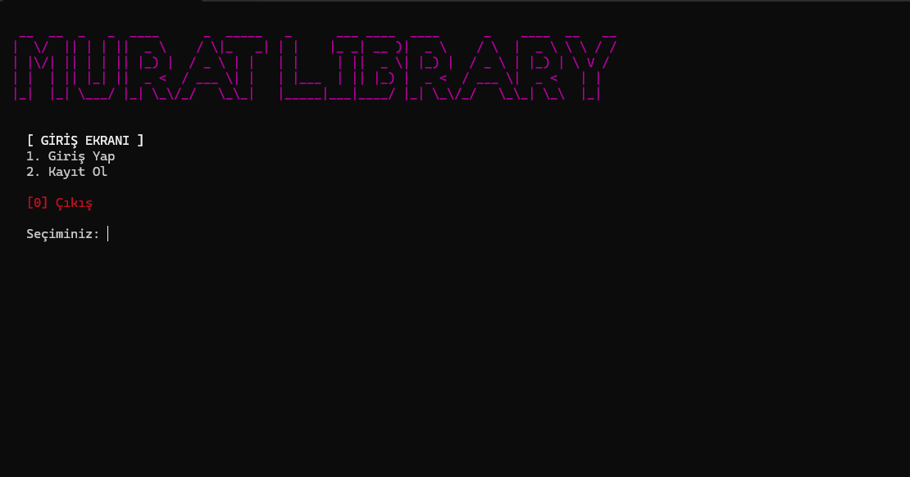
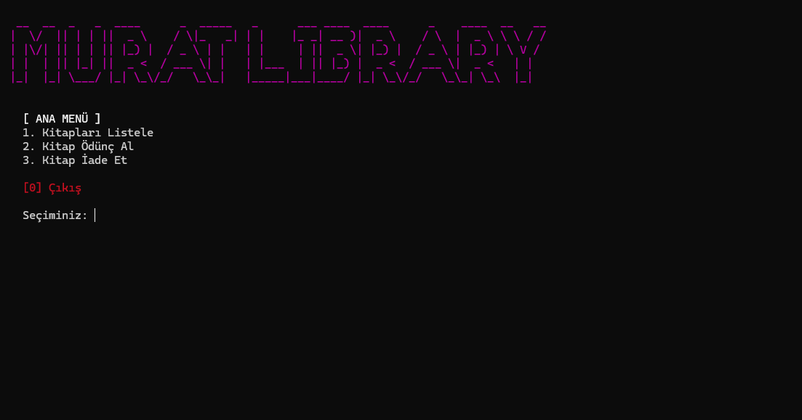
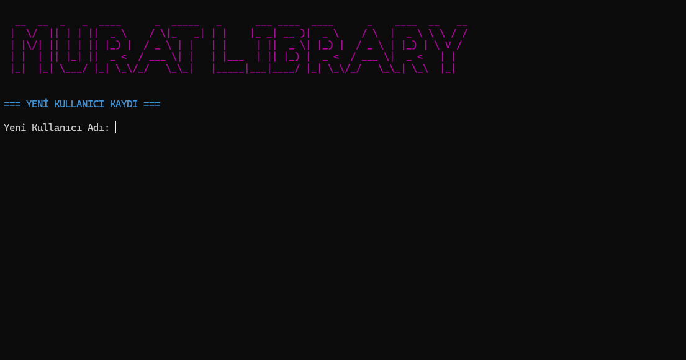

# 📚 Library Management System




Gelişmiş, güvenli ve kullanıcı dostu bir konsol tabanlı **Kütüphane Yönetim Sistemi**. C++ dili kullanılarak geliştirilmiştir ve bellek yönetimi (pointers), zaman manipülasyonu ve nesne yönelimli programlama temellerini içerir.





## 🚀 Özellikler

* **🔒 Kullanıcı Kimlik Doğrulama:**
    * Giriş Yap (Login) ve Kayıt Ol (Register) sistemi.
    * Varsayılan Admin girişi.
* **🎨 Modern Arayüz:**
    * Renkli terminal çıktıları (ANSI Escape Codes).
    * ASCII Art Logo tasarımı.
    * Sayfa tabanlı navigasyon sistemi.
* **📖 Kitap Yönetimi:**
    * Dinamik envanter listeleme.
    * Stok durumu kontrolü (Rafta/Ödünçte).
* **⏳ Gecikme ve Ceza Sistemi:**
    * Zaman damgası (Timestamp) takibi.
    * Geciken kitaplar için otomatik ceza hesaplama (Günlük faiz).
* **🛠️ Teknik Yapı:**
    * **Pointers:** Veri manipülasyonu için doğrudan bellek erişimi.
    * **Structs:** Kitap ve Kullanıcı veri yapıları.
    * **Vectors:** Dinamik veri listeleri.

## 🛠️ Kurulum ve Çalıştırma

Bu projeyi bilgisayarınızda çalıştırmak için aşağıdaki adımları izleyebilirsiniz:

Projeyi bilgisayarınıza klonlayın:

```bash
git clone https://github.com/Omer-Murat/Library-Management-System.git
```
Geliştirici: Ömer Murat

---
*Bu proje açık kaynaklıdır ve eğitim amaçlı geliştirilmiştir.*
